<p align="center">
 
 <h2 align="center">Uçak Rezervasyon Sistemi</h2>
</p>


---

## Anasayfa


## Admin
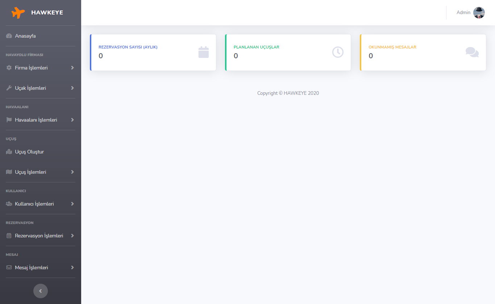

---

## Gerekli Kütüphaneler
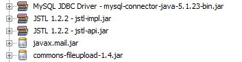

### mysql-connector-java-5.1.23-bin.jar
Uygulamamızı MySQL veri tabanına bağlamak için kullanılır.

### JSTL 1.2.2
JSP sayfalarında JSTL ile çalışmak için kullanılır. JSTL, temel etiketler ve işlevlerden oluşan bir koleksiyondur. Bu etiketler ve işlevler, JSP kodunu verimli bir şekilde yazmamızı sağlar.

### javax.mail.jar
E-postayı JavaMail API kullanarak göndermek için jar dosyasını projemize dahil ediyoruz.

### commons-fileupload-1.4.jar
Form verileri POST isteğinde alınan, bir dosya veya form öğesine erişim sağlar. Dosya yükleme işlemi için kullanıyoruz.

---

## Mimari
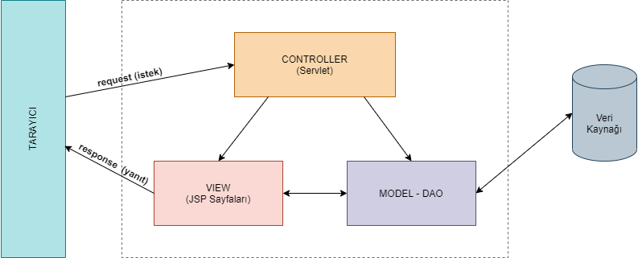

Projede MVC mimarisi kullanılmıştır.
MVC, Model, View ve Controller anlamına gelir.

- **Model - DAO :** Uygulamada kullanılan verileri temsil eder. Veritabanına erişim, sınıflar, veritabanı ilişkileri gibi veri ile ilgili işlemlerin olduğu bölüm.

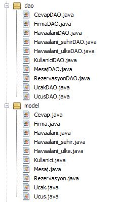

- **View :** Projenin kullanıcılara sunulacak olan JSP dosyaları yer almaktadır. Bir görevi de, kullanıcılardan alınan istekleri Controller’ a iletmektir.

`Admin Sayfaları`

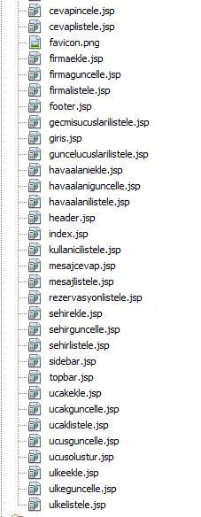

`Kullanıcı Sayfaları`

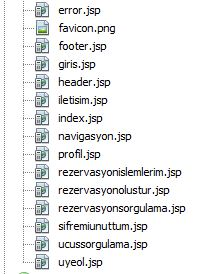

- **Controller :** Controller, MVC’de projenin iç süreçlerini kontrol eden bölümdür. Bu bölümde View ile Model arasındaki bağlantı kurulur. Kullanıcılardan gelen istekler (request) Controller’larda değerlendirilir, isteğin detayına göre hangi işlemlerin yapılacağı ve kullanıcıya hangi View’ın döneceği (response) belirtilir.

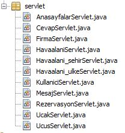

## Senaryo (Adminin oluşturulan uçuşlardan birini silmesi)

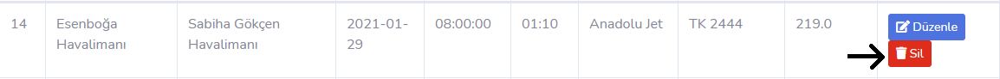

View bu değişiklik isteğini algılayıp bunu Controller iletecek.

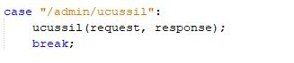

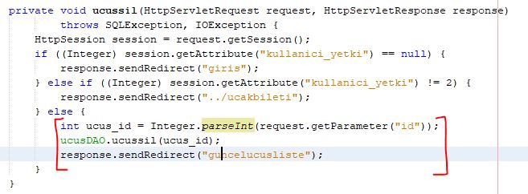

Controller tüm kontrolleri yaptıktan sonra verinin silinmesi için DAO bölümüne güncelleme gönderir. 

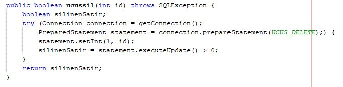

DAO bu güncellemeyi veri üzerine yansıttıktan sonra tekrardan Controller bu güncellemenin yapıldığı bilgisini gönderir ve bu doğrultuda View güncellenir.

---

## Oluşturulan Sınıflar ve Açıklaması

### Cevap

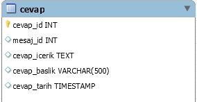

- **Cevap.java :** Cevap tablosunun modelini oluşturmaktadır.
İçerisinde tablodaki niteliklerin değişken olarak oluşturmuş hali , bu değişkenlerin getter setter metotları ve yapılandırıcı metotlar bulunmaktadır.

- **CevapDAO.java :** Cevap tablosunun veri erişim sınıfıdır.
Gerçekleşen İşlemler; cevapların listelenmesi, cevapların incelenmesi,  gelen mesaja cevap verilmesi, cevabın veritabanından silinmesi.

- **CevapServlet.java :** JSP sayfası ile Model - DAO sınıfı arasında bağlantı kurar. Kullanıcıdan gelen mesaj cevaplama, cevapları listeleme, cevap silme veya cevap inceleme işlemlerinden kullanıcının isteğine göre hangi işlemin yapılacağını ve kullanıcıya hangi JSP sayfasının döneceğini belirtir.

### Firma 

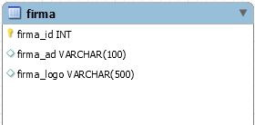

- **Firma.java :** Firma tablosunun modelini oluşturmaktadır.
İçerisinde tablodaki niteliklerin değişken olarak oluşturmuş hali , bu değişkenlerin getter setter metotları ve yapılandırıcı metotlar bulunmaktadır.

- **FirmaDAO.java :** Firma tablosunun veri erişim sınıfıdır.
Gerçekleşen İşlemler; firmaların listelenmesi, firma eklenmesi,  firmanın bilgilerinin güncellenmesi, firmanın veritabanından silinmesi.

- **FirmaServlet.java :** JSP sayfası ile Model - DAO sınıfı arasında bağlantı kurar. Kullanıcıdan gelen firmaları listeleme, yeni firma oluşturma, firma güncelleme, firma silme işlemlerinden kullanıcının isteğine göre hangi işlemin yapılacağını ve kullanıcıya hangi JSP sayfasının döneceğini belirtir.

### Havaalanı

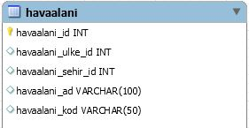

- **Havaalani.java :** Havaalani tablosunun modelini oluşturmaktadır.
İçerisinde tablodaki niteliklerin değişken olarak oluşturmuş hali , bu değişkenlerin getter setter metotları ve yapılandırıcı metotlar bulunmaktadır.

- **HavaalaniDAO.java :** Havaalani tablosunun veri erişim sınıfıdır.
Gerçekleşen İşlemler; havaalanlarının listelenmesi, havaalanı eklenmesi, havaalanının bilgilerinin güncellenmesi, havaalanının veritabanından silinmesi. 

- **HavaalaniServlet.java :** JSP sayfası ile Model - DAO sınıfı arasında bağlantı kurar. Kullanıcıdan gelen havaalanları listeleme, yeni havaalanı oluşturma, havaaalanı güncelleme, havaalanı silme işlemlerinden kullanıcının isteğine göre hangi işlemin yapılacağını ve kullanıcıya hangi JSP sayfasının döneceğini belirtir.

### Havaalanı Şehir

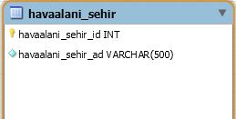

- **Havaalani_sehir.java :** Havaalani_sehir tablosunun modelini oluşturmaktadır.
İçerisinde tablodaki niteliklerin değişken olarak oluşturmuş hali , bu değişkenlerin getter setter metotları ve yapılandırıcı metotlar bulunmaktadır.

- **Havaalani_sehirDAO.java :** Havaalani_sehir tablosunun veri erişim sınıfıdır.
Gerçekleşen İşlemler; şehirlerin listelenmesi, şehir eklenmesi, şehir bilgilerinin güncellenmesi, şehrin veritabanından silinmesi. 

- **Havaalani_sehirServlet.java :** JSP sayfası ile Model - DAO sınıfı arasında bağlantı kurar. Kullanıcıdan gelen şehirleri listeleme, yeni şehir oluşturma, şehir güncelleme, şehir silme işlemlerinden kullanıcının isteğine göre hangi işlemin yapılacağını ve kullanıcıya hangi JSP sayfasının döneceğini belirtir.

### Havaalanı Ülke

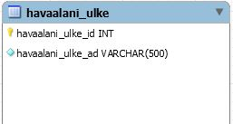

- **Havaalani_ulke.java :** Havaalani_ulke tablosunun modelini oluşturmaktadır.
İçerisinde tablodaki niteliklerin değişken olarak oluşturmuş hali , bu değişkenlerin getter setter metotları ve yapılandırıcı metotlar bulunmaktadır.

- **Havaalani_ulkeDAO.java :** Havaalani_ulke tablosunun veri erişim sınıfıdır.
Gerçekleşen İşlemler; ülkelerin listelenmesi, ülke eklenmesi, ülke bilgilerinin güncellenmesi, ülkenin veritabanından silinmesi.  

- **Havaalani_ulkeServlet.java :** JSP sayfası ile Model - DAO sınıfı arasında bağlantı kurar. Kullanıcıdan gelen ülkeleri listeleme, yeni ülke oluşturma, ülke güncelleme, ülke silme işlemlerinden kullanıcının isteğine göre hangi işlemin yapılacağını ve kullanıcıya hangi JSP sayfasının döneceğini belirtir.

### Kullanıcılar

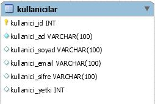

- **Kullanici.java :** Kullanicilar tablosunun modelini oluşturmaktadır.
İçerisinde tablodaki niteliklerin değişken olarak oluşturmuş hali , bu değişkenlerin getter setter metotları ve yapılandırıcı metotlar bulunmaktadır.

- **KullaniciDAO.java :** Kullanicilar tablosunun veri erişim sınıfıdır.
Gerçekleşen İşlemler; kullanıcıların listelenmesi, sisteme giriş yaparken şifrenin kontrol edilmesi, unutulan şifrenin veritabanından çekilmesi, kullanıcı bilgilerinin güncellenmesi, yeni kullanıcı / admin oluşturulması, kullanıcının / adminin veritabanından silinmesi. 

- **KullaniciServlet.java :** JSP sayfası ile Model - DAO sınıfı arasında bağlantı kurar. Kullanıcıdan gelen üye olma, sisteme giriş yapma, yeni şifre talebi,  sistemden çıkış yapma, kullanıcıların listelenmesi, kullanıcıların silinmesi, kullanıcı/admin bilgilerinin güncellenmesi işlemlerinden kullanıcının isteğine göre hangi işlemin yapılacağını ve kullanıcıya hangi JSP sayfasının döneceğini belirtir.

### Mesaj

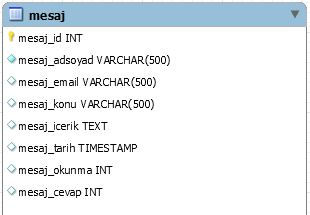

- **Mesaj.java :** Mesaj tablosunun modelini oluşturmaktadır.
İçerisinde tablodaki niteliklerin değişken olarak oluşturmuş hali , bu değişkenlerin getter setter metotları ve yapılandırıcı metotlar bulunmaktadır.

- **MesajDAO.java :** Mesaj tablosunun veri erişim sınıfıdır.
Gerçekleşen İşlemler; gelen mesajların veritabanına kaydedilmesi, gelen mesajların listelenmesi, mesaj okunmuşsa okundu bilgisinin güncellenmesi, mesaja cevap verilmişse cevap bilgisinin güncellenmesi, mesajın veritabanından silinmesi.

- **MesajServlet.java :** JSP sayfası ile Model - DAO sınıfı arasında bağlantı kurar. Kullanıcıdan gelen mesajları listeleme,  gelen mesajın silinmesi, gelen mesajın veritabanına eklenmesi, iletişim sayfasına erişim sağlanması işlemlerinden kullanıcının isteğine göre hangi işlemin yapılacağını ve kullanıcıya hangi JSP sayfasının döneceğini belirtir.

### Rezervasyon

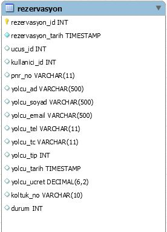

- **Rezervasyon.java :** Rezervasyon tablosunun modelini oluşturmaktadır.
İçerisinde tablodaki niteliklerin değişken olarak oluşturmuş hali , bu değişkenlerin getter setter metotları ve yapılandırıcı metotlar bulunmaktadır.

- **RezervasyonDAO.java :** Rezervasyon tablosunun veri erişim sınıfıdır.
Gerçekleşen İşlemler; kullanıcıdan alınan bilgilere göre uçuş listelenmesi, uçuştan 2 saat  önceye kadar iptal yada bilgi güncellemesi yapabilme işlemi, seçilen koltuğun dolu-boş olmasının kontrolü, veritabanına rezervasyon bilgilerinin eklenmesi, rezervasyon bilgilerinin güncellenmesi, seçilen uçuş bilgilerine erişim.

- **RezervasyonServlet.java :** JSP sayfası ile Model - DAO sınıfı arasında bağlantı kurar. Uçuş sorgulama, rezervasyon listelenmesi, rezervasyonun iptal edilmesi, rezervasyon sorgulaması, rezervasyon oluşturulması, rezervasyon bilgilerinin güncellenmesi işlemlerinden kullanıcının isteğine göre hangi işlemin yapılacağını ve kullanıcıya hangi JSP sayfasının döneceğini belirtir.

### Uçak

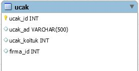

- **Ucak.java :** Ucak tablosunun modelini oluşturmaktadır.
İçerisinde tablodaki niteliklerin değişken olarak oluşturmuş hali , bu değişkenlerin getter setter metotları ve yapılandırıcı metotlar bulunmaktadır.

- **:UcakDAO.java :** Ucak tablosunun veri erişim sınıfıdır.
Gerçekleşen İşlemler; uçakların listelenmesi, seçilen uçağın silinmesi, veritabanına uçak eklenmesi, uçak bilgilerinin güncellenmesi. 

- **UcakServlet.java :** JSP sayfası ile Model - DAO sınıfı arasında bağlantı kurar. Kullanıcıdan gelen uçakları listeleme, yeni uçak bilgileri oluşturma, uçak bilgileri güncelleme, uçak silme işlemlerinden kullanıcının isteğine göre hangi işlemin yapılacağını ve kullanıcıya hangi JSP sayfasının döneceğini belirtir.

### Uçuş

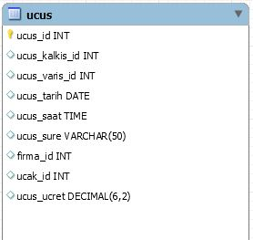

- **Ucus.java :** Ucus tablosunun modelini oluşturmaktadır.
İçerisinde tablodaki niteliklerin değişkenlerin getter setter metotları ve yapılandırıcı metotlar bulunmaktadır.

- **:UcusDAO.java :** Ucus tablosunun veri erişim sınıfıdır.
Gerçekleşen İşlemler; güncel ve geçmiş uçuşların listelenmesi, seçilen uçuşun silinmesi, seçilen uçağın müsaitlik durumuna göre veritabanına uçuş eklenmesi, uçuş bilgilerinin güncellenmesi. 

- **UcusServlet.java :** JSP sayfası ile Model - DAO sınıfı arasında bağlantı kurar. Kullanıcıdan gelen güncel veya geçmiş uçuşların listelenmesi, uçağın müsaitlik durumuna göre yeni uçuş bilgileri oluşturma, uçuş bilgilerinin güncelleme, oluşturulan uçuşu silme işlemlerinden kullanıcının isteğine göre hangi işlemin yapılacağını ve kullanıcıya hangi JSP sayfasının döneceğini belirtir.

### Anasayfa

`Kullanıcı Anasayfası`


`Admin Anasayfası`

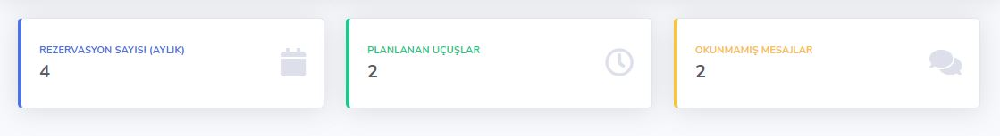

- **AnasayfalarServlet.java :** JSP sayfası ile Model - DAO sınıfı arasında bağlantı kurar. 
Kullanıcıdan gelen anasayfa görüntüleme işleminde eğer görüntülenmek istenen sayfa admin anasayfası ise veritabanından aylık rezervasyon sayısı, planlanan uçuşlar ve okunmamış mesajların sayısı çekilecektir ve kullanıcıya JSP sayfası olarak admin anasayfası dönecektir.
Kullanıcıdan gelen anasayfa görüntüleme işleminde eğer görüntülenmek istenen sayfa kullanıcı anasayfası ise veritabanında kayıtlı havayolları çekilecektir gidiş ve varış yeri olarak kullanıcıda görüntülenecektir  ve kullanıcıya JSP sayfası olarak kullanıcı anasayfası dönecektir.

---

## Kod Parçaları & Ekran Görüntüleri

### Giriş Yapma

```java
private void gostergiris(HttpServletRequest request, HttpServletResponse response)
            throws SQLException, IOException {
        HttpSession session = request.getSession();
        if ((Integer) session.getAttribute("kullanici_yetki") == null) {
            String kullanici_email = request.getParameter("kullanici_email");
            String kullanici_sifre = request.getParameter("kullanici_sifre");

            Boolean kontrol = kullaniciDAO.uyegiriskontrol(kullanici_email, kullanici_sifre);
            if (kontrol == true) {
                Kullanici uye = kullaniciDAO.uyegiris(kullanici_email, kullanici_sifre);
                int kullanici_yetki = uye.getKullanici_yetki();
                String kullanici_ad = uye.getKullanici_ad();
                String kullanici_soyad = uye.getKullanici_soyad();
                int kullanici_id = uye.getKullanici_id();

                session.setAttribute("kullanici_id", kullanici_id);
                session.setAttribute("kullanici_ad", kullanici_ad);
                session.setAttribute("kullanici_soyad", kullanici_soyad);
                session.setAttribute("kullanici_email", kullanici_email);
                session.setAttribute("kullanici_yetki", kullanici_yetki);
                session.setAttribute("kullanici_sifre", kullanici_sifre);

                response.sendRedirect("ucakbileti");
            } else {
                response.sendRedirect("giris?durum=basarisiz");
            }
        } else {
            response.sendRedirect("ucakbileti");
        }
    }
```

Aşağıdaki kod satırı ile 

`Boolean kontrol = kullaniciDAO.uyegiriskontrol(kullanici_email, kullanici_sifre);`

giriş yapmak isteyen kullanıcının sistemde kayıtlı olup olmadığını kontrol ediyoruz. 

Eğer kullanıcı sistemde kayıtlıysa aşağıdaki işlem ile

`kullaniciDAO.uyegiris(kullanici_email, kullanici_sifre);`

kullanıcının bilgilerini veritabanından çekip bu bilgiler ile `setAttribute` işlemini gerçekleştiriyoruz.

Eğer sistemde kayıtlı olmayan bir kullanıcı ise Giriş başarısız hatası verecektir.

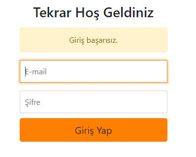

### Çıkış Yapma

```java
private void uyecikis(HttpServletRequest request, HttpServletResponse response)
            throws SQLException, IOException {

        HttpSession session = request.getSession();
        session.invalidate();
        response.sendRedirect("ucakbileti");
        }
```

Aşağıdaki kod satırı ile 

`session.invalidate();`

oturum işlemini sonlandırıyoruz.

`Admin Panelinde Çıkış`

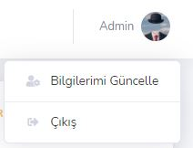

`Kullanıcı Ekranından Çıkış`

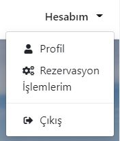

`response.sendRedirect("ucakbileti");` Çıkış işlem gerçekleştikten sonra anasayfaya yönlendiriliyor.

### Üye Olma

```java
private void gosteruyeol(HttpServletRequest request, HttpServletResponse response)
            throws SQLException, IOException {
        HttpSession session = request.getSession();
        if ((Integer) session.getAttribute("kullanici_yetki") == null) {
            String kullanici_ad = request.getParameter("kullanici_ad");
            String kullanici_soyad = request.getParameter("kullanici_soyad");
            String kullanici_email = request.getParameter("kullanici_email");
            String kullanici_sifre = request.getParameter("kullanici_sifre1");
            Boolean kontrol = kullaniciDAO.uyekontrol(kullanici_email);
            if (kontrol == true) {
                Kullanici yeniKullanici = new Kullanici(kullanici_ad, kullanici_soyad, kullanici_email, kullanici_sifre);
                kullaniciDAO.uyeol(yeniKullanici);
                response.sendRedirect("uyeol?durum=basarili");
            } else {
                response.sendRedirect("uyeol?durum=basarisiz");
            }
        } else {
            response.sendRedirect("ucakbileti");
        }
    }
```

Aşağıdaki kod satırı ile

`Boolean kontrol = kullaniciDAO.uyekontrol(kullanici_email);`

üye olmak isteyen kullanıcının email adresinin sistemde kayıtlı olup olmadığını kontrol ediyoruz. Eğer email adresi sistemde kayıtlı değilse aşağıdaki işlem ile

`kullaniciDAO.uyeol(yeniKullanici);`

yeni kullanıcıyı veritabanına ekliyoruz.

Eğer sistemde kayıtlı bir email adresi kullanarak üye olmaya çalışır ise Bu Email kullanılıyor.  hatası verecektir.


### Mesaj Durum - Mesaj Cevap

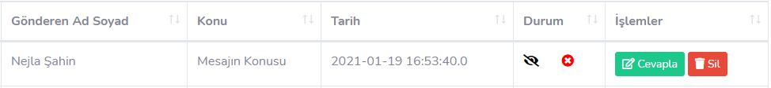

1. :eye_speech_bubble:  mesajın okunup okunmadığı ile ilgidir. Göz ikonunun üstünde slash işareti varsa henüz mesajın okunmadığı anlamına gelir.

2. :x: mesaja cevap verilip verilmediğini belirtir. Çarpı işareti varsa henüz mesaja cevap verilmediği anlamına gelir.

Okunmuş ve cevap verilmiş görünümü

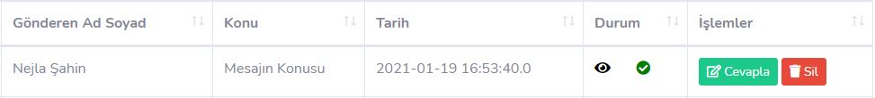

Mesaja cevap verme işlemi ise

```java
private void gostermesajcevapla(HttpServletRequest request, HttpServletResponse response)
    throws SQLException, IOException {
        HttpSession sessionn = request.getSession();
        if ((Integer) sessionn.getAttribute("kullanici_yetki") == null) {
            response.sendRedirect("giris");
        }else if((Integer) sessionn.getAttribute("kullanici_yetki") != 2){
            response.sendRedirect("../ucakbileti");
        }else{
            int mesaj_id = Integer.parseInt(request.getParameter("mesaj_id"));
            String mesaj_email = request.getParameter("mesaj_email");
            String cevap_baslik = new String((request.getParameter("cevap_baslik")).getBytes("ISO-8859-1"), "UTF-8");
            String cevap_icerik = new String((request.getParameter("cevap_icerik")).getBytes("ISO-8859-1"), "UTF-8");
            Cevap yenicevap = new Cevap(mesaj_id,cevap_icerik,cevap_baslik);

            final String to = mesaj_email; 
            final String subject = cevap_baslik;
            final String messg = cevap_icerik;
            final String from = "mail@gmail.com";
            final String pass = "sifre";

            Properties props = new Properties();    
            props.put("mail.smtp.host", "smtp.gmail.com");    
            props.put("mail.smtp.socketFactory.port", "465");    
            props.put("mail.smtp.socketFactory.class", "javax.net.ssl.SSLSocketFactory");    
            props.put("mail.smtp.auth", "true");    
            props.put("mail.smtp.port", "465");     
            Session session = Session.getDefaultInstance(props,    
            new javax.mail.Authenticator() {    
                @Override
                protected PasswordAuthentication getPasswordAuthentication() {    
                    return new PasswordAuthentication(from,pass);  
                }    
            });       
            try {    
               MimeMessage message = new MimeMessage(session);
               message.addRecipient(Message.RecipientType.TO,new InternetAddress(to));    
               message.setSubject(subject, "UTF-8");    
               message.setText(messg, "UTF-8");    
               Transport.send(message);    
            } catch (MessagingException e) {throw new RuntimeException(e);

            }        
            mesajDAO.mesajcevap(mesaj_id);
            cevapDAO.cevapekle(yenicevap);
            response.sendRedirect("cevapliste");
        }    
    }
```

SMTP protokolü ile kullanıcının mesajına dönüş yapıyoruz.

## Uçuş oluşturma - Uçak Kontrol

```java
private void gosterucusolustur(HttpServletRequest request, HttpServletResponse response)
            throws SQLException, IOException {
        HttpSession session = request.getSession();
        if ((Integer) session.getAttribute("kullanici_yetki") == null) {
            response.sendRedirect("giris");
        } else if ((Integer) session.getAttribute("kullanici_yetki") != 2) {
            response.sendRedirect("../ucakbileti");
        } else {
            int ucus_kalkis_id = Integer.parseInt(request.getParameter("ucus_kalkis_id"));
            int ucus_varis_id = Integer.parseInt(request.getParameter("ucus_varis_id"));
            String ucus_tarih = request.getParameter("ucus_tarih");
            String ucus_saat = request.getParameter("ucus_saat");
            String ucus_sure = request.getParameter("ucus_sure");
            int firma_id = Integer.parseInt(request.getParameter("firma_id"));
            int ucak_id = Integer.parseInt(request.getParameter("ucak_id"));
            double ucus_ucret = Double.parseDouble(request.getParameter("ucus_ucret"));

            Ucus yeniucus = new Ucus(ucus_kalkis_id, ucus_varis_id, ucus_tarih, ucus_saat, ucus_sure, firma_id, ucak_id, ucus_ucret);
            Boolean sonuc = ucusDAO.ucuskontrol(yeniucus);
            if (sonuc == false) {
                response.sendRedirect("guncelucusliste?durum=basarisiz");
            } else {
                ucusDAO.ucusolustur(yeniucus);
                response.sendRedirect("guncelucusliste");
            }
        }
    }
```

Aşağıdaki kod satırı ile 

`Boolean sonuc = ucusDAO.ucuskontrol(yeniucus);`

seçilen uçağın belirtilen saatler arasında uçuşu olup olmadığını kontrol ediyoruz. Eğer o saatler arası başka uçuşu yoksa uçuş oluşturma işlemini gerçekleştirecektir.

Eğer başka uçuş varsa

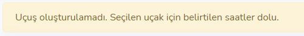

uyarısını verecektir.

## Uçuş Sorgulama

```java
private void ucussorgulama(HttpServletRequest request, HttpServletResponse response)
            throws SQLException, ServletException, IOException {
        int havaalani_kalkis_id = Integer.parseInt(request.getParameter("gidis"));
        int havaalani_varis_id = Integer.parseInt(request.getParameter("varis"));
        String ucus_tarih = request.getParameter("gidis_tarih");
        int yetiskin_sayi = Integer.parseInt(request.getParameter("yetiskin"));
        int cocuk_sayi = Integer.parseInt(request.getParameter("cocuk"));

        Rezervasyon rezervasyon = new Rezervasyon(havaalani_kalkis_id, havaalani_varis_id, ucus_tarih, yetiskin_sayi, cocuk_sayi);
        request.setAttribute("rezervasyon", rezervasyon);
        List<Rezervasyon> tekyonsorgula = rezervasyonDAO.tekyonsorgulama(rezervasyon);
        request.setAttribute("ucussorgulama", tekyonsorgula);
        List<Havaalani> havaalaniliste = havaalaniDAO.havaalaniliste();
        request.setAttribute("havaalaniliste", havaalaniliste);
        RequestDispatcher dispatcher = request.getRequestDispatcher("ucussorgulama.jsp");
        dispatcher.forward(request, response);
    }
```

Kullanıcı bilgileri girdikten sonra uçuş arama işlemini gerçekleştiriyor. Eğer girilen bilgilere uygun uçuş varsa aşağıdaki listelenecektir.

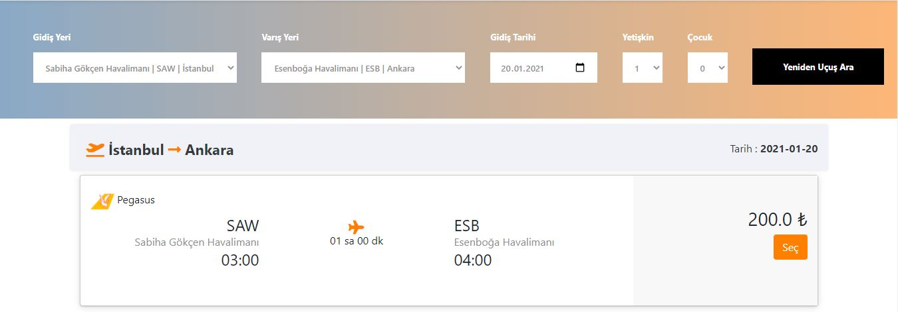

Girilen bilgilere uygun uçuş yoksa Uçuş Bulunamadı uyarısını alacaklardır.

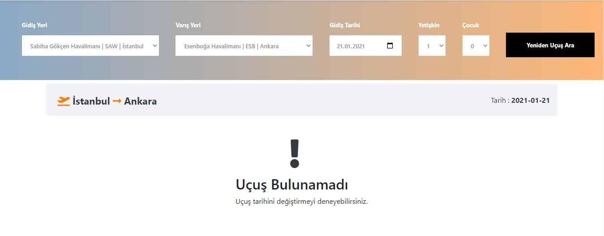

Veritabanında sorgulama yapmadan önce girilen bilgilerden tarih değerini kontrol ediyoruz. Eğer uçuşu arattığı tarih bugün ise uçuşa 1 saatten az vakti kalan uçuşlar kullanıcıya listelenmeyecektir. Eğer bugün uçuşu arattığı tarih bugün değil ise o gün içindeki tüm uçuşları listeleyecektir.

Sorgulama yaparken yolcu sayısı uçaklardaki boş koltuk sayısı ile karşılaştırılıp uçakta yer varsa sorgulama sonucu verecektir. Yer yoksa kullanıcılara bu uçuşlar gösterilmeyecektir.

## Rezervasyon oluşturma - Koltuk kontrol

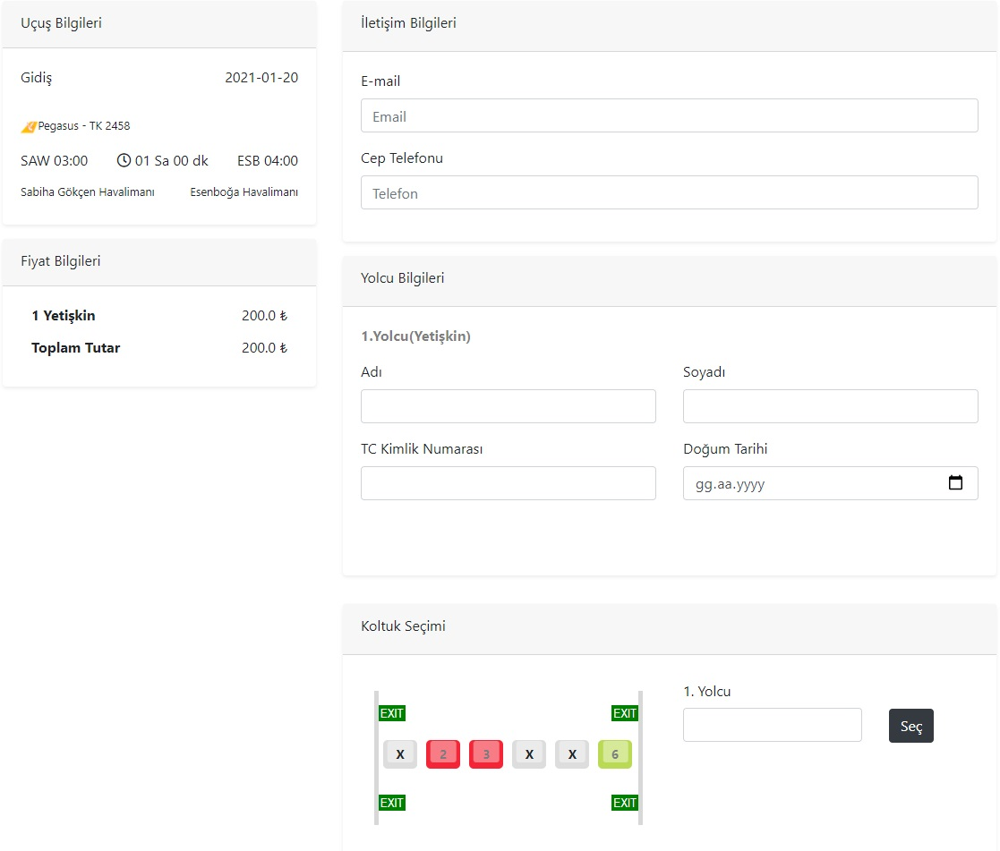

Yukarıdaki rezervasyon oluşturma formunda kullanıcı gerekli tüm bilgileri girdikten sonra aşağıdaki `gosterrezervasyonislemlerim` fonksiyonunu çağırıyor.

```java
private void gosterrezervasyonislemlerim(HttpServletRequest request, HttpServletResponse response)
            throws SQLException, IOException {
        HttpSession session = request.getSession();
        if ((Integer) session.getAttribute("kullanici_yetki") == null) {
            response.sendRedirect("giris");
        } else if ((Integer) session.getAttribute("kullanici_yetki") != 1) {
            response.sendRedirect("ucakbileti");
        } else {
            int ucus_id = Integer.parseInt(request.getParameter("ucus_id"));
            int kullanici_id = (int) session.getAttribute("kullanici_id");
            String yolcu_email = request.getParameter("yolcu_email");
            String yolcu_tel = request.getParameter("yolcu_tel");
            String pnr_no;
            int c_sayi = Integer.parseInt(request.getParameter("c_sayi"));
            int y_sayi = Integer.parseInt(request.getParameter("y_sayi"));
            Double u_ucret = Double.parseDouble(request.getParameter("u_ucret"));
            int yolcu_tip;
            String yolcu_ad;
            String yolcu_soyad;
            String yolcu_tc;
            String yolcu_tarih;
            String yolcu_koltuk;
            Boolean sonuc = false;
            for (int i = 1; i <= (c_sayi + y_sayi); i++) {
                yolcu_koltuk = request.getParameter("yolcu_koltuk" + i);
                sonuc = rezervasyonDAO.koltukkontrol(ucus_id, yolcu_koltuk);
            }
            if (sonuc == true) {
                response.sendRedirect("rezervasyonislemlerim?durum=basarisiz");
            } else {
                for (int i = 1; i <= (c_sayi + y_sayi); i++) {
                    pnr_no = getAlphaNumericString(8);
                    yolcu_tip = Integer.parseInt(request.getParameter("yolcu_tip" + i));
                    yolcu_ad = new String((request.getParameter("yolcu_ad" + i)).getBytes("ISO-8859-1"), "UTF-8");
                    yolcu_soyad = new String((request.getParameter("yolcu_soyad" + i)).getBytes("ISO-8859-1"), "UTF-8");
                    yolcu_tc = request.getParameter("yolcu_tc" + i);
                    yolcu_tarih = request.getParameter("yolcu_tarih" + i);
                    yolcu_koltuk = request.getParameter("yolcu_koltuk" + i);
                    Rezervasyon rezervasyon = new Rezervasyon(pnr_no, yolcu_ad, yolcu_soyad, yolcu_email, yolcu_tel, yolcu_tc, yolcu_tip, yolcu_koltuk, kullanici_id, ucus_id, yolcu_tarih, u_ucret);
                    rezervasyonDAO.rezervasyonekle(rezervasyon);
                }

                response.sendRedirect("rezervasyonislemlerim?durum=basarili");
            }
        }
    }
```

Formdaki kullanıcıdan girilen tüm bilgileri ve seçilen koltuk numaralarını alarak kontrol işlemini gerçekleştiriyoruz. Eğer seçilen koltuk başka bir kullanıcı tarafından alınmışsa aşağıdaki uyarıyı verecektir.

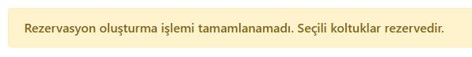

Eğer seçilen koltuklar boşsa rezervasyon oluşturma işlemini gerçekleştirecektir.

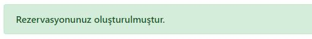

## Rezervasyon iptal ve Bilgi güncelleme

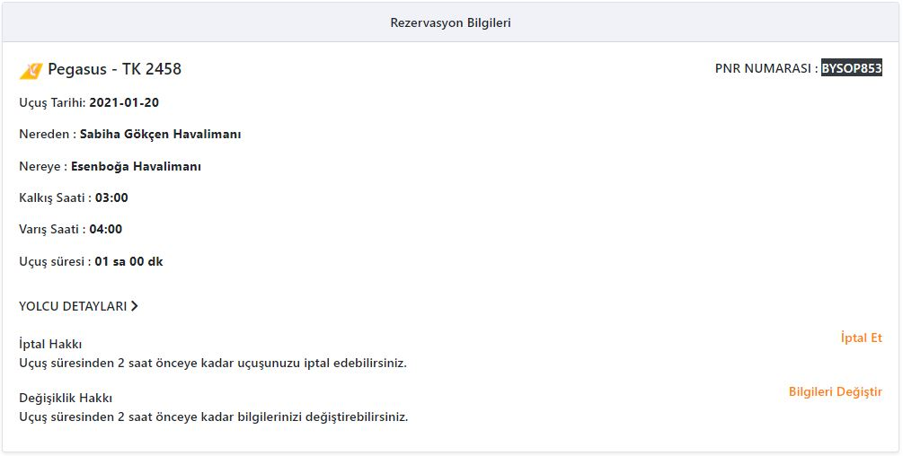

Rezervasyon oluşturduktan sonra uçuş süresinden 2 saat önceye kadar uçuşu iptal edebiliriz. 

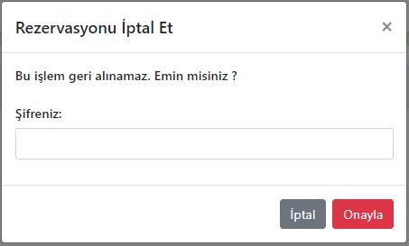

İptal etme işlemini gerçekleştirmek için şifre girmek gerekmektedir.

```java
private void reziptal(HttpServletRequest request, HttpServletResponse response)
            throws SQLException, IOException {
        HttpSession session = request.getSession();
        if ((Integer) session.getAttribute("kullanici_yetki") == null) {
            response.sendRedirect("giris");
        } else if ((Integer) session.getAttribute("kullanici_yetki") != 1) {
            response.sendRedirect("ucakbileti");
        } else {
            int rezervasyon_id = Integer.parseInt(request.getParameter("rezervasyon_id"));
            String kullanici_sifre = (String) session.getAttribute("kullanici_sifre");
            String sifre = request.getParameter("sil_sifre");
            if (kullanici_sifre.equals(sifre)) {
                rezervasyonDAO.rezervasyoniptal(rezervasyon_id);
                response.sendRedirect("rezervasyonislemlerim?iptal=basarili");
            } else {
                response.sendRedirect("rezervasyonislemlerim?iptal=basarisiz");
            }
        }
    }
```

Eğer şifreyi yanlış girersek

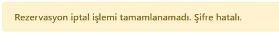

uyarısını bize verecektir.

Şifreyi doğru girersek 

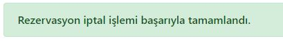

uyarısını bize verecektir ve rezervasyon işlemini iptal edecektir.

Aynı şekilde uçuş süresinden 2 saat önceye kadar yolcu detayları kısmındaki 

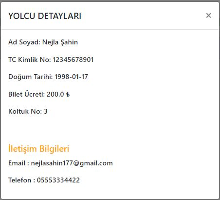

Bilgilerimizi de değiştirebiliriz.

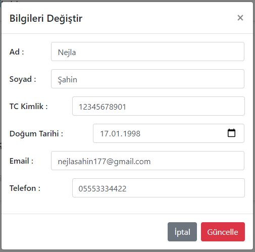

Eğer uçuşa 2 saatten daha az bir süre kaldıysa görüntü bu şekilde değişecektir.

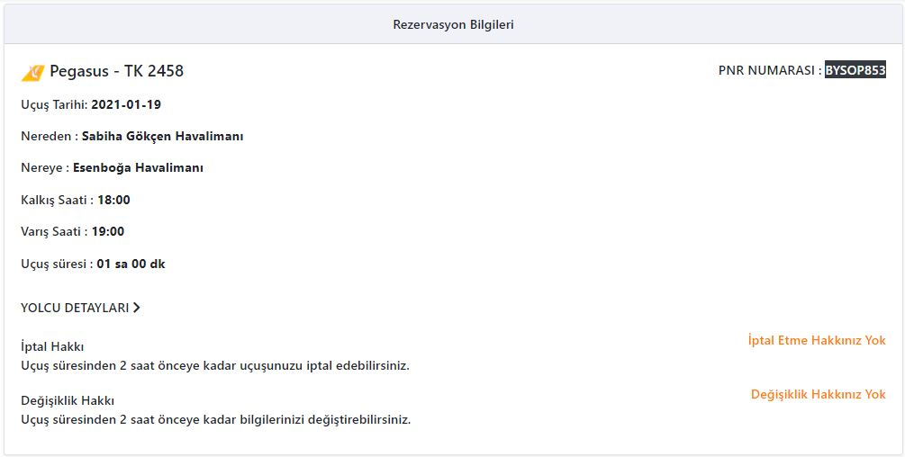

## Logo yükleme

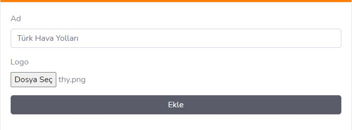

```java
private void gosterfirmaekle(HttpServletRequest request, HttpServletResponse response)
    throws SQLException, IOException, ServletException {
        HttpSession session = request.getSession();
        if ((Integer) session.getAttribute("kullanici_yetki") == null) {
            response.sendRedirect("giris");
        }else if((Integer) session.getAttribute("kullanici_yetki") != 2){
            response.sendRedirect("../ucakbileti");
        }else{
            String firma_logo = null;
            String firma_ad = null;

            response.setContentType("text/html; charset=UTF-8");

            boolean isMultipartContent = ServletFileUpload.isMultipartContent(request);
            if (!isMultipartContent) {
                return;
            }
            FileItemFactory factory = new DiskFileItemFactory();
            ServletFileUpload upload = new ServletFileUpload(factory);
            upload.setHeaderEncoding("UTF-8");
            try {
                List< FileItem> fields = upload.parseRequest(request);
                Iterator< FileItem> it = fields.iterator();
                if (!it.hasNext()) {
                    return;
                }

                while (it.hasNext()) {
                    FileItem fileItem = it.next();
                    boolean isFormField = fileItem.isFormField();
                    if (isFormField) {
                        if (firma_ad == null) {
                            if (fileItem.getFieldName().equals("firma_ad")) {
                                firma_ad = fileItem.getString("UTF-8");
                            }
                        }
                    } else {
                        if (fileItem.getSize() > 0) {
                            firma_logo = fileItem.getName();
                            fileItem.write(new File("C:\\Users\\Asus\\Documents\\NetBeansProjects\\hawkeye\\web\\assets\\data\\" + firma_logo));                            
                        }
                    }
                }
            } catch (Exception e) {
                e.printStackTrace();
            }

            Firma yenifirma = new Firma(firma_ad, firma_logo);
            firmaDAO.firmaekle(yenifirma);
            response.sendRedirect("firmaliste");
        }       
    }   
```

Aşağıdaki kod satırı ile 

`boolean isMultipartContent = ServletFileUpload.isMultipartContent(request);` 

içerik türünün multipart/form-data olup olmadığını kontrol ediyoruz. Eğer içerik türü multipart/form-data ise logoyu yükleme işlemini gerçekleştiriyoruz.

`fileItem.write(new File("C:\Users\Asus\Documents\NetBeansProjects\hawkeye\web\assets\data\" + firma_logo));`

Logoyu belirttiğimiz dosya yoluna kaydediyoruz.

## Logo silme

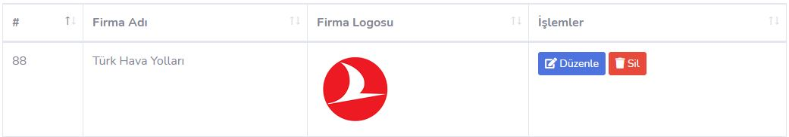

```java
private void firmasil(HttpServletRequest request, HttpServletResponse response)
    throws SQLException, IOException {
        HttpSession session = request.getSession();
        if ((Integer) session.getAttribute("kullanici_yetki") == null) {
            response.sendRedirect("giris");
        }else if((Integer) session.getAttribute("kullanici_yetki") != 2){
            response.sendRedirect("../ucakbileti");
        }else{
            int firma_id = Integer.parseInt(request.getParameter("id"));
            String firma_logo = request.getParameter("logo");
            File f = new File("C:\\Users\\Asus\\Documents\\NetBeansProjects\\hawkeye\\web\\assets\\data\\" + firma_logo);
            f.delete();
            firmaDAO.firmasil(firma_id);
            response.sendRedirect("firmaliste");
        }        
}
```

Aşağıdaki kod satırı ile 

`File f = new File("C:\Users\Asus\Documents\NetBeansProjects\hawkeye\web\assets\data\" + firma_logo);`

silmek istediğimiz dosyanın yolunu belirtiyoruz.

`f.delete();`

Komutu ile dosyanın klasörden silinmesi işlemini gerçekleştiriyoruz.

`firmaDAO.firmasil(firma_id);`

Komutu ile firmayı veritabanından siliyoruz.
